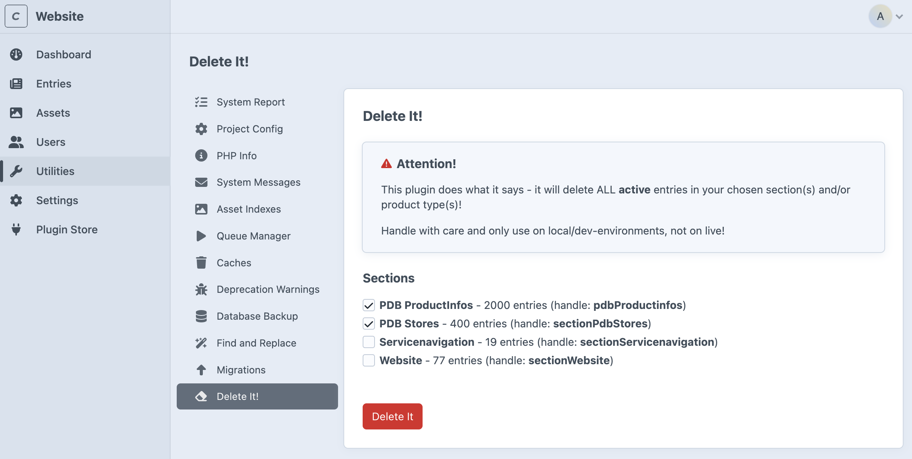

# Delete it!

This plugin bulk-deletes entries or products.

Plugin will delete ALL active entries in your chosen section(s) and/or product type(s)!

Handle with care and only use on local/dev-environments, not on live!



## Requirements

This plugin requires Craft CMS 5.0.0 or later, and PHP 8.2 or later.

## Installation

You can install this plugin from the Plugin Store or with Composer.

#### From the Plugin Store

Go to the Plugin Store in your project’s Control Panel and search for “Delete it”. Then press “Install”.

#### With Composer

Open your terminal and run the following commands:

```bash
# go to the project directory
cd /path/to/my-project.test

# tell Composer to load the plugin
composer require iwf/craft-delete-it

# tell Craft to install the plugin
./craft plugin/install delete-it
```

Brought to you by [IWF](https://www.iwf.ch/web-solutions).
